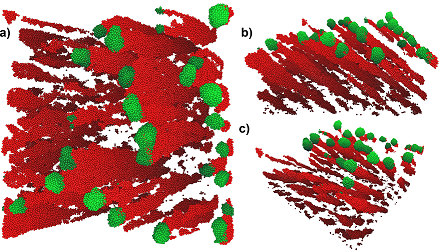

# BallisticDeposition software
Software written to simulate ballistic deposition, particularly for glancing angle deposition (GLAD). Simulations can be performed in discrete space or in continuous space.

All particles are generated with their identity, source, and orientation being independent of the other particles. The process is entirely sequential: each particle is fully incorporated before beginning with the next particle.

To create heterostructures and more complex shapes, simulated films can be used as substrates for future simulations.

## Discrete-space simulations
In discrete-space simulations, the volume is divided into a 3D integer array of elements that represent sites for atoms/particles. Each site is either empty or filled. The size of the volume and the distance between sites is arbitrary, with no physical meaning.

Diffusion is modeled by a sequence of hops to nearby sites by a weighted random walk.

Both multi-element depositions can be simulated. Different structural shapes can be controlled by substrate rotation before and during growth. 

## Continuous-space simulations
The volume and individual particles are given physically-meaningful dimensions in continuous-space simulations.

Diffusion is implemented by minima-determination of potential energy or by intermolecular forces, both calculated by the Lennard-Jones model.

Currently, no substrate rotation is possible in continuous-space simulations due to a space-partitioning method used to increase simulation speed.

## Files and analysis
The simulations are saved in compressed file containers, including the positions of particles in the simulated film, simulation parameters,  and the diffusion length.

Analysis is carried out separately with Python scripts that will be released in full later. An early repository for the analysis is [here](https://github.com/shawnwwimer/GLADMonteCarlo-public).

## Publications
The publications using this simulation software are still in preparation and will include:
- Si/Ag and Si/Au heterostructure deposition and simulation of deposition,
- investigation of the methods and models in ballistic deposition simulation, and
- the effects of angular flux deviation.

## Attributions
The simulation software uses modified functions from [cnpy](https://github.com/rogersce/cnpy), which in turn depends on [zlib](https://zlib.net/). In a previous iteration, [NLOPT](https://nlopt.readthedocs.io/en/latest/) was used for some minimization of potentials.

