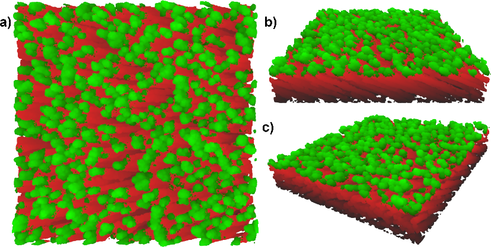

Simulate ballistic deposition of multiple thin-film layers with a focus on glancing angle deposition (GLAD). Simulations can be performed in discrete space or in continuous space, with multiple elements, and includes many configurable parameters.

# Project structure
This is a Visual Studio 2019 solution consisting of three projects:
* BallisticDeposition: a C/C++ project to create an executable with detailed configuration,
* BD_DLL: a DLL to expose code in the C/C++ project, and
* BDSS: A C# WPF project for a GUI to simulate multilayer depositions by using BD_DLL.

## BallisticDeposition software
All particles are generated with their identity, source, and orientation being independent of the other particles. The process is entirely sequential: each particle is fully incorporated before beginning with the next particle.

To create heterostructures and more complex shapes, simulated films can be used as substrates for future simulations.

### Discrete-space simulations
In discrete-space simulations, the volume is divided into a 3D integer array of elements that represent sites for atoms/particles. Each site is either empty or filled. The size of the volume and the distance between sites is arbitrary, with no physical meaning.

Diffusion is modeled by a sequence of hops to nearby sites by a weighted random walk.

Both multi-element depositions can be simulated. Different structural shapes can be controlled by substrate rotation before and during growth. 

### Continuous-space simulations
The volume and individual particles are given physically-meaningful dimensions in continuous-space simulations.

Diffusion is implemented by minima-determination of potential energy or by intermolecular forces, both calculated by the Lennard-Jones model.

Currently, no substrate rotation is possible in continuous-space simulations due to a space-partitioning method used to increase simulation speed.

## BD_DLL
A C++/CLI DLL that exposes methods for discrete simulation. The wrapper class `BallisticSimulation` is offered, which implements the methods `initializeSimulation()`, `cleanup()`, and `simulateFilm()`. It is used by first invoking `initalizeSimulation()` to allocate memory and create a flat substrate, followed by any number of calls to `simulateFilm()`, where each call simulates the deposition of a new layer, and ended by calling `cleanup()` to free the memory. All discrete simulation parameters used in BallisticSimulation are offered in BD_DLL but continuous simulations are not yet implemented.

## BDSS
A WPF project that uses BD_DLL to simulate multilayer films. Currently it is in a rudimentary state, configured for basic Si simulations, so it is not currently possible to include multiple elements, redefine the diffusion weights, choose a different collision method, or an acceleration pattern. As BD_DLL does not yet implement continuous simulations, neither does BDSS.

# Files and analysis
The simulations are saved in compressed file containers, including the positions of particles in the simulated film, simulation parameters, and the diffusion length.

Analysis is carried out separately with Python scripts that will be released in full later. An early repository for the analysis is [here](https://github.com/shawnwwimer/GLADMonteCarlo-public).

# Publications
The publications using this simulation software are still in preparation and will include:
- Si/Ag and Si/Au heterostructure deposition and simulation of deposition,
- investigation of the methods and models in ballistic deposition simulation, and
- the effects of angular flux deviation.

# Attributions
The simulation software uses modified functions from [cnpy](https://github.com/rogersce/cnpy), which in turn depends on [zlib](https://zlib.net/). In a previous iteration, [NLOPT](https://nlopt.readthedocs.io/en/latest/) was used for some minimization of potentials.

